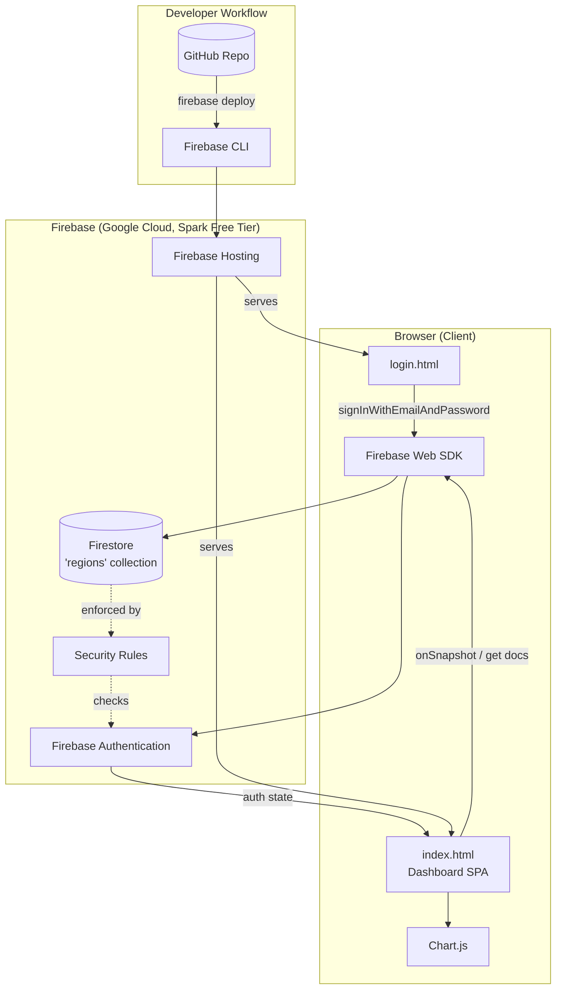
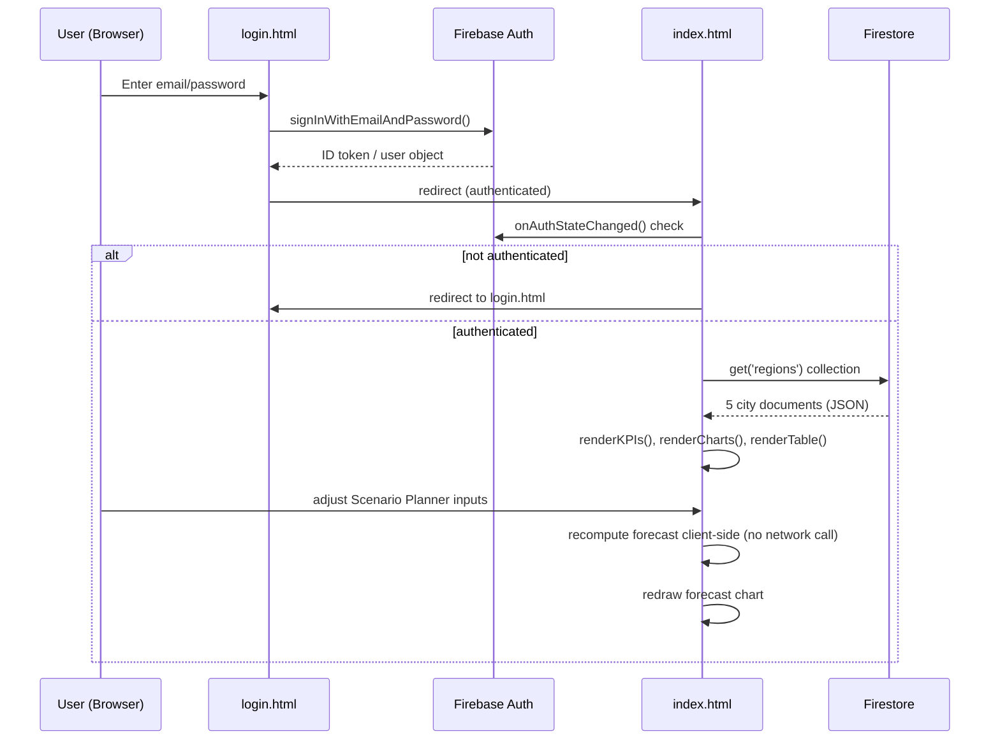

# ARCHITECTURE.md — HealthEdge Capacity Intelligence

## 1. Finalized Tech Stack

| Layer | Choice | Why it's the best fit |
|---|---|---|
| **Frontend** | Plain HTML, CSS, JavaScript + Chart.js (extends the existing Day 15 single-file dashboard) | Zero build tooling, zero cost, and the project is AI-prompt-guided rather than hand-coded — a framework (React/Vue) would add complexity with no payoff at this scale. Reuses proven visual design and charts. |
| **Backend** | None (serverless) — Firebase Firestore accessed directly from the client SDK | With 5 cities × 10 years of mostly-static data and no server-side business logic beyond simple aggregation, a dedicated backend server is unnecessary overhead. Firestore's client SDK + security rules fully cover read/write needs. |
| **Database** | Firebase Firestore (free "Spark" tier) | Free, generous limits for this data volume (~50 documents), real-time capable if ever needed, and integrates natively with Firebase Auth for row-level security via rules — no ORM or server required. |
| **Authentication** | Firebase Authentication (Email/Password provider) | Free, drop-in, no user-management server to build. Invite-only accounts are created manually in console — matches the "small trusted network" access model. |
| **AI Model/API** | Not required for v1.0 | No AI-generated content or inference is part of the product itself (AI is used only as a development aid, not a runtime dependency). Noted here so nothing is silently assumed. |
| **Hosting** | Firebase Hosting (free tier) | One command (`firebase deploy`) ships a static site to a real HTTPS URL, from the same account already used for Auth/Firestore — no third DevOps tool to learn. |
| **Version Control** | GitHub (free) | Industry-standard, free private/public repos, protects against local data loss. |
| **Charts** | Chart.js (already in use) | Already proven in the existing template; avoids a rewrite of working chart code. |

**Design principle:** every choice is free-tier and requires no server Claude/you would have to operate, patch, or pay for — the entire "backend" is Firebase's managed services plus static files.

## 2. System Architecture

### 2.1 Component Diagram

### 2.2 Data Flow

### 2.3 Request Lifecycle (Dashboard Load)

1. Browser requests `index.html` from Firebase Hosting (static file, CDN-served).
2. Inline `<script>` initializes the Firebase app (config from `firebase-config.js`).
3. `onAuthStateChanged` listener fires; if no user session, redirect to `login.html`.
4. If authenticated, client calls Firestore `getDocs(collection(db, 'regions'))`.
5. Firestore Security Rules check `request.auth != null` before returning documents.
6. Data returned as 5 JSON documents; client transforms into in-memory JS objects.
7. Render functions (`renderKPIs`, `renderDensityChart`, `renderGapChart`, `renderTrendChart`, `renderTable`) draw the UI using Chart.js.
8. All later interactions (region filter, Scenario Planner, CAGR calculator) are **pure client-side recomputation** — no further network calls, since the full dataset is already in memory.

### 2.4 AI Interaction

Not applicable at runtime — v1.0 has no AI/LLM API calls in the product itself. (AI assistance is used only during development, outside this architecture.)

### 2.5 External Services

| Service | Purpose | Cost |
|---|---|---|
| Firebase Authentication | Login/session management | Free (Spark) |
| Firebase Firestore | Data storage | Free (Spark), well under quota at ~50 docs |
| Firebase Hosting | Static site delivery + HTTPS | Free (Spark) |
| GitHub | Source control | Free |

No payment processor, no third-party analytics, no external AI API in v1.0 — keeps the product fully within free tooling as required.

## 3. Scalability & Security Notes

- Firestore security rules (locked down on Day 8) restrict all reads/writes to `request.auth != null`, so unauthenticated users cannot read data even if they find the Firestore project ID.
- Because there is no custom server, there is no server to patch, scale, or pay for — Firebase Hosting's CDN and Firestore's managed infrastructure absorb any realistic traffic for an invite-only tool.
- Future scope (multi-workspace accounts, live data sync) would introduce Cloud Functions as a lightweight backend layer — deliberately deferred out of v1.0 to keep the stack simple.
