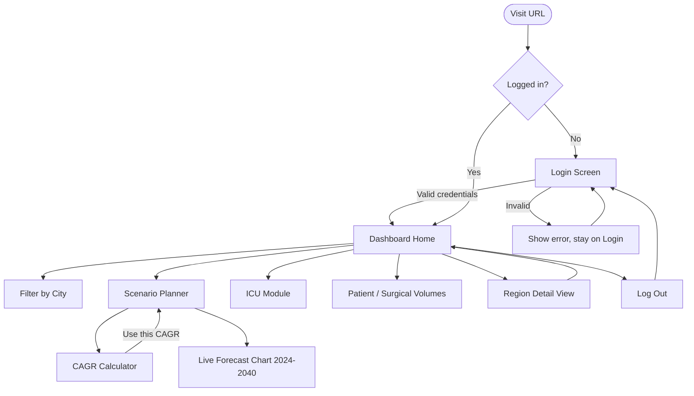

# UI-WIREFRAMES.md — User Journey & Screens

## 1. User Flow Diagram



## 2. Screen Flow (why each screen exists)

| Screen | Exists because... |
|---|---|
| **Login** | Gatekeeper — protects the dataset (Day 8 requirement); no public signup |
| **Dashboard Home** | Single-page hub for KPIs, the 3 core charts, and the region table — the primary "at a glance" view |
| **Scenario Planner (section within Dashboard)** | The product's signature differentiator — forecasting is the core value proposition |
| **ICU Module (section)** | ICU capacity is a distinct, high-stakes metric that deserves its own focused KPIs/chart, not buried in the general table |
| **Patient/Surgical Volumes (sections)** | Public-vs-private share shift is a distinct investment-signal narrative, separate from bed capacity |
| **Region Detail (modal or sub-view)** | Lets a user drill into one city's full 10-year numbers without cluttering the multi-city overview |

No screen exists purely for navigation's sake — every screen maps to a PRD user story.

## 3. Low-Fidelity Wireframes

### Login Screen
```
┌─────────────────────────────────────┐
│         HealthEdge Capacity          │
│            Intelligence              │
│                                       │
│   Email    [_____________________]   │
│   Password [_____________________]   │
│                                       │
│            [   Log In   ]            │
│                                       │
│   (error message appears here)       │
└─────────────────────────────────────┘
```

### Dashboard Home
```
┌───────────────────────────────────────────────────┐
│ HealthEdge Capacity Intelligence         [Log Out] │
├───────────────────────────────────────────────────┤
│ Filter: [Dubai] [Abu Dhabi] [Riyadh] [Jeddah] [Dammam] │
├───────────────────────────────────────────────────┤
│  KPI    KPI    KPI    KPI     (bed density, gap,   │
│ card1  card2  card3  card4     occupancy, ICU)     │
├───────────────────────────────────────────────────┤
│  [ Bed Density Chart ]   [ Bed Gap Chart ]         │
│  [        10-Year Trend Chart (2014–2023)       ]  │
├───────────────────────────────────────────────────┤
│  Region Table                                       │
│  City | Beds | ICU | Occ.% | ... | [View Details]  │
├───────────────────────────────────────────────────┤
│  ▸ Scenario Planner (expand)                        │
│  ▸ ICU Module (expand)                               │
│  ▸ Patient Volumes (expand)                          │
│  ▸ Surgical Volumes (expand)                         │
│  Methodology & Sources                               │
└───────────────────────────────────────────────────┘
```

### Scenario Planner (expanded section)
```
┌───────────────────────────────────────────────────┐
│ Scenario Planner                                    │
│                                                       │
│  CAGR Calculator                                     │
│  Start value [____] Year [____]                      │
│  End value   [____] Year [____]      [Calculate]     │
│  Result: 3.2%   [Use this CAGR]                       │
│                                                       │
│  Main CAGR: [___%]  Occupancy Target: [___%]          │
│  Specialty Demand: [Rising ▾]                          │
│                                                       │
│  [   Forecast Chart: 2014 real ── 2040 projected   ]  │
│                       (dashed after 2023)              │
└───────────────────────────────────────────────────┘
```

### ICU Module / Volume Sections (same pattern, repeated)
```
┌───────────────────────────────────────────────────┐
│ ICU Module                                           │
│  KPI: Total ICU Beds   KPI: ICU Occupancy %          │
│  KPI: ICU Gap vs Standard                             │
│  [ ICU Density Comparison Chart — 5 cities ]          │
└───────────────────────────────────────────────────┘

┌───────────────────────────────────────────────────┐
│ Patient Volumes                                      │
│  Callout: "Private share grew from 30% → 45%"         │
│  [ Public vs Private Volume Trend Chart, by city ▾ ]  │
└───────────────────────────────────────────────────┘
```

## 4. Navigation

- **Top-level nav is minimal by design:** one page (`index.html`) with in-page anchored sections plus expand/collapse cards — no multi-page router needed, matching the "no framework" stack decision.
- **Login/Logout** are the only real page transitions (`login.html` ↔ `index.html`).
- **Region filter** persists across all sections (global state on the page) so a user picks a city once and sees it reflected in KPIs, charts, ICU Module, and Volumes sections together.
- **"View Details"** opens the Region Detail view (modal or inline expand) and closes back to the same scroll position — no full navigation away from the dashboard.

## 5. Mobile Considerations (Day 9 responsive QA)

- KPI cards stack vertically below tablet width.
- City filter chips wrap to multiple rows instead of horizontal scroll.
- Charts resize via Chart.js responsive option; no fixed pixel widths (per Day 9 debugging notes).
